# Global-Life-Expectancy-Dashboard

### PowerBi Report

Life expectancy is one of the most important indicators of a nation's health and development. It reflects the combined impact of healthcare access, economic conditions, education, disease burden, nutrition, and public health policies.This project analyzes global life expectancy trends from 2000 to 2015 using data from the World Health Organization (WHO). The goal is to identify patterns in life expectancy across countries and investigate the factors that influence longevity.The analysis was conducted using Power BI and focuses on life expectancy trends, socioeconomic drivers, healthcare investment, and child health indicators.

 </tr>
    <tr>
      <td>🌐</td>
      <td><a href="https://app.powerbi.com/view?r=eyJrIjoiZDQxNmE3N2ItMzM2Yi00MmFiLWE3NzktYTQ3ZWYzYjBmNWYzIiwidCI6ImUwYjEzY2QwLTY1MjItNDFmNS05MjFlLTg5OGRmMTBkZGIzMiJ9">View Live Dashboard</a></td>   |      </tr>
    <tr>
      <td>📃</td>
      <td><a href="https://drive.google.com/file/d/1WgS58LyHl22u_3CLZQ4s-1X9JIAuwH5A/view?usp=sharing">Dataset</a></td> |       <tr>
      <td>👤</td>
      <td><a href="https://linkedin.com/in/afolakemi-olalekan-145174253">Linkdin Profile</a></td>   |   </tr>
    <tr>
      <td>🌐</td>
      <td><a href="https://olalekan4545.github.io/Port-folio/">Portfolio</a></td>

      

## 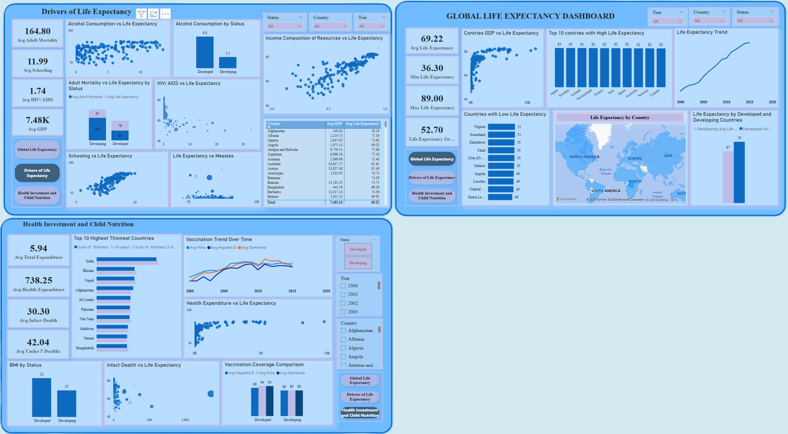

## Problem Statement
Despite significant improvements in global healthcare, life expectancy continues to vary widely across countries. Understanding the factors associated with longer and shorter lifespans can help policymakers and health organizations make informed decisions.
This project seeks to answer:
- How has life expectancy changed globally over time?
- Which countries have the highest and lowest life expectancy?
- How do developed and developing countries compare?
- What factors are most strongly associated with life expectancy?
- How do healthcare investment and child health outcomes influence longevity?

## Objective
The aims of this project is to:
Analyze global life expectancy trends between 2000 and 2015.
Compare life expectancy across countries and development status.
Identify key drivers of life expectancy such as GDP, schooling, adult mortality, HIV/AIDS, and income composition.
Examine the role of healthcare expenditure, vaccination coverage, and child nutrition.
Provide data-driven insights into global health inequalities.

## Dataset Information
- **Time Period**: 2000–2015
- Country
- Year
- Status (Developed/Developing)
- Life Expectancy
- Adult Mortality
- Infant Deaths
- Alcohol Consumption
- Percentage Expenditure
- Hepatitis B
- Measles
- BMI
- Under-Five Deaths
- Polio
- Total Expenditure
- Diphtheria
- HIV/AIDS
- GDP
- Population
- Thinness (1–19 Years)
- Thinness (5–9 Years)
- Income Composition of Resources
- Schooling

## Data Cleaning
The dataset contained missing values across several variables, including GDP, Life Expectancy,Population, Hepatitis B, Schooling, and Total Expenditure.

**Data Quality Approach**
Missing values were retained as nulls.
No imputation was performed to avoid introducing assumptions.
Aggregate calculations automatically excluded blank values.
Data types were validated before analysis.

## Dashboard Structure

**Page 1: Global Life Expectancy**

.png)

**Focus**:
- Global life expectancy
- Country comparison
- Developed vs Developing countries
- Geographic distribution of life expectancy.

**Life Expectancy Trend by Year**

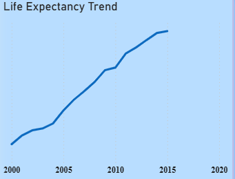

Global life expectancy generally increased between 2000 and 2015, indicating improvements in healthcare access and living conditions.

**Top 10 Countries by Life Expectancy**

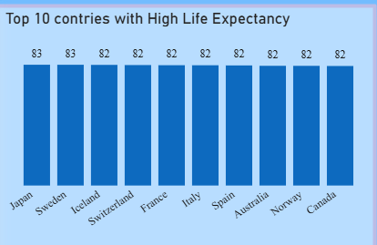 

Japan, Sweden, and other top-performing countries consistently recorded the highest life expectancy levels, indicating strong healthcare systems, higher standards of living, and favorable socioeconomic conditions that support longer lifespans.

**Bottom 10 Countries by Life Expectancy**

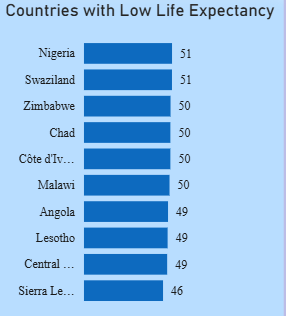

Sierra Leone, the Central African Republic, and other bottom-ranking countries recorded the lowest life expectancy levels, indicating significant health and development challenges that limit population longevity.

**Life Expectancy by Status**

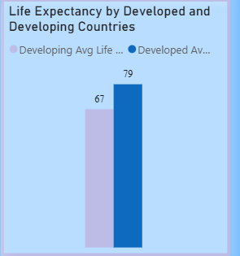

Developed countries achieved an average life expectancy of 79 years, exceeding developing countries by 12 years, highlighting the strong influence of economic development, healthcare access, and living standards on population longevity.

**GDP vs Life Expectancy**

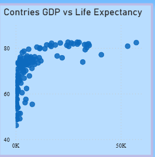

Countries with higher GDP generally tend to have higher life expectancy, although the wide variation across countries suggests that factors such as healthcare access, education, and disease burden also play an important role in determining longevity.

**Global Map**

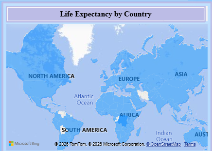

This Chart shows the Life Expectancy of Countries across the globe.

**Page 2: Drivers of Life Expectancy**

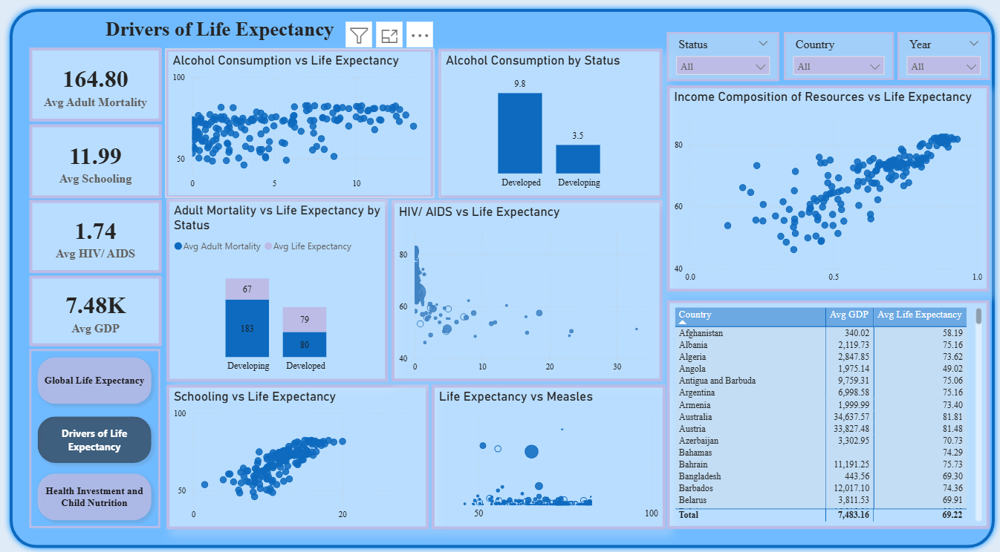

**Focus**

Socioeconomic and health-related factors associated with longevity

**Visuals**

**Schooling vs Life Expectancy**

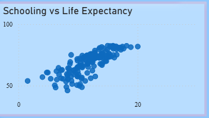

The chart shows a strong positive relationship between schooling and life expectancy, countries that record higher average years of education generally achieving longer lifespans. This suggests that education may contribute to better health awareness, improved economic opportunities, healthier lifestyle choices, and greater access to healthcare services.

**Adult Mortality vs Life Expectancy by Status**

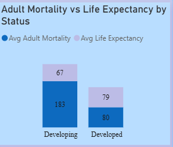 

Developing countries recorded a higher average adult mortality rate (183) and a lower life expectancy (67 years), while developed countries recorded a lower adult mortality rate (80) and a higher life expectancy (79 years), indicating that higher adult mortality is associated with shorter lifespans and poorer health outcomes.

**HIV/AIDS vs Life Expectancy**

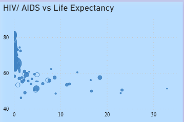

The scatter chart reveals a strong negative relationship between HIV/AIDS and life expectancy. Countries with higher HIV/AIDS rates tend to record lower life expectancy, suggesting that a greater disease burden is associated with shorter average lifespans. As HIV/AIDS increases, life expectancy generally declines, highlighting the significant impact of infectious diseases on population health outcomes.

**Income Composition of Resources vs Life Expectancy**

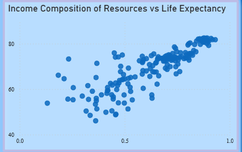

Income Composition of Resources appears to be a strong predictor of life expectancy. Countries with higher resource development and stronger socioeconomic conditions generally achieve longer and more stable lifespans, while countries with lower levels of resource development tend to experience lower life expectancy and greater health challenges.

**Page 3: Health Investment & Child Nutrition**

.png)

**Focus**

- Healthcare spending
- Vaccination coverage
- Child mortality

**Visuals**

**Health Expenditure vs Life Expectancy**

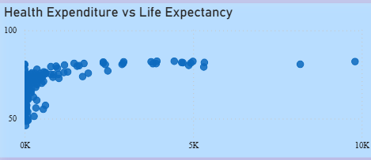

Health expenditure shows a positive association with life expectancy, suggesting that investment in healthcare contributes to improved longevity. However, spending alone does not determine outcomes, as education, disease prevention, nutrition, and healthcare quality also influence life expectancy.

**Vaccination Coverage Analysis by Year**

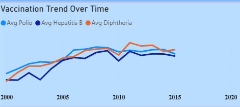

The consistent increase in vaccination coverage suggests that countries have made significant progress in expanding preventive healthcare services and strengthening disease control efforts. This improvement may contribute to lower mortality rates and better overall population health outcomes.

**Vaccination Coverage Comparison Between Developing and Develop Countries**

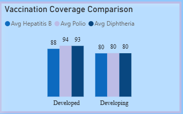

The gap in vaccination coverage between developed and developing countries suggests that stronger healthcare infrastructure and immunization systems in developed nations support better disease prevention, while lower coverage in developing countries may pose challenges to achieving similar health outcomes and longevity.

**infact Deaths vs Life Expectancy**

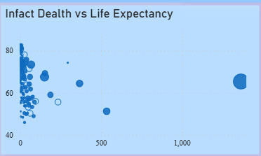

The chart reveals a strong negative relationship between infant deaths and life expectancy, with countries experiencing higher infant mortality generally recording shorter average lifespans. This suggests that improvements in maternal care, child healthcare, and disease prevention can contribute significantly to increased life expectancy.

**Top 10 Thinness Countries**

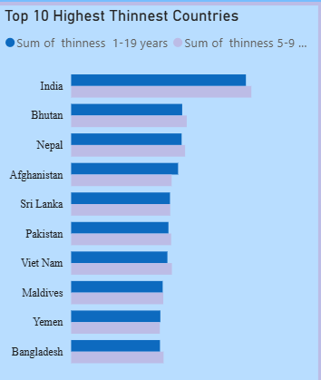

High thinness rates in the top-ranking countries suggest persistent challenges related to nutrition and child health. Addressing undernutrition through targeted health and food security programs may help improve overall population well-being and support longer life expectancy.

**BMI by Status**

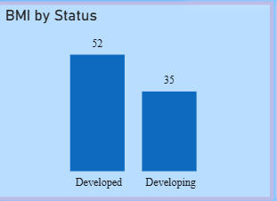

Developed countries recorded a higher average BMI (52) compared to developing countries (35), suggesting differences in nutrition, food availability, and living standards between the two groups. The higher BMI in developed countries may reflect better access to food and lower rates of undernutrition, while the lower BMI in developing countries may indicate ongoing nutritional challenges in some populations.

## Key Insights
1. Global life expectancy generally increased between 2000 and 2015, indicating improvements in healthcare access and living conditions.
2. Developed Countries Outperformed Developing Countries
3. Adult Mortality Had a Strong Negative Relationship with Life Expectancy
Countries with higher adult mortality rates tended to have significantly lower life expectancy.
4. Higher levels of schooling were associated with longer life expectancy, emphasizing the importance of education in improving health outcomes.
5. Countries with higher GDP and stronger income composition generally exhibited longer lifespans.
6. Higher HIV/AIDS burden was associated with lower life expectancy across many countries.
7. Countries with high under-five mortality and child malnutrition generally recorded lower life expectancy.

## Tools Used
Power BI : For Visualization

Power Query : for cleaning and structuring the dataset

DAX : for calcuations

## Conclusion
The analysis demonstrates that life expectancy is influenced by a combination of economic, educational, healthcare, and social factors. Countries with stronger healthcare systems, higher educational attainment, lower mortality rates, and better socioeconomic conditions consistently achieved longer lifespans.
The findings highlight the importance of sustained investment in healthcare, education, disease prevention, and child welfare to improve population health outcomes and reduce global health inequalities.

## File Included

Global_Life_Expectancy_dashboard.pbix / [`Life_Expectancy_Dashboard.pbix`](Life_Expectancy_Dashboard.pbix) 

├──  Global_life_Expectancy_dataset.CSV

│        └── data/[`Life_Expectancy_Data.csv`](Life_Expectancy_Data.csv) 

├── Insight.md

│     └── Insights/ [`Insights.md`](Insights.md) 

│

└── README.md / [`README.md`](README.md) 

## How to Use
1. Download the .pbix file from the dashboard folder [`Life_Expectancy_Dashboard.pbix`](Life_Expectancy_Dashboard.pbix)
2. Open with Power BI Desktop [Power BI Desktop](https://powerbi.microsoft.com/).
3.  Use slicers to explore insights across different dimensions

   

### 👨‍💻 About Me
I am a Data Analyst specializing in Excel and Powerbi. I love turning messy data into clean and actionable stories.

🔗 [Linkdin_Profile](https://linkedin.com/in/afolakemi-olalekan-145174253)

